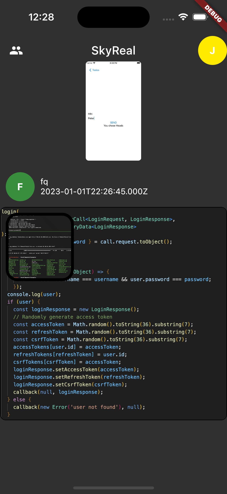

# SkyReal - A BeReal clone made with flutter, nodejs and mariadb

## What is SkyReal?

Every day at a different time, everyone is notified simultaneously to capture and share a Photo in 2 Minutes.

## Screenshots

## Default Credentials

justANormalUser: User123

## Tech Stack

- Flutter (Client)
- NodeJS (Server)
- MariaDB (Database)
- Python (Notifcation Service)
- Redis (Storage for the timer)
- OneSignal (Push Notifications)
